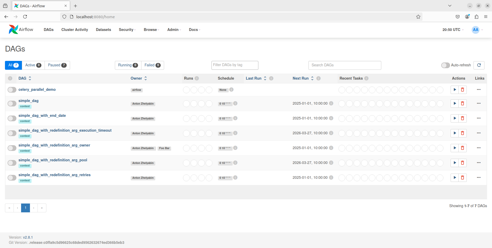

# Airflow-Dag-settings
## О проекте
В этом репозитории рассматриваются: 
- DAG'и с различными настройками конфигурации: start_date, end_date, retries, retry_delay, execution_timeout.
- Задана функция zero_division и DAG, который всегда падает, на таком примере можно. видеть работу ретраев и логов.
- Пулы (pool) в Airflow: как ограничить параллелизм на уровне таски и посмотреть это в Cluster Activity.

Airflow запускается в docker с CeleryExecutor.

